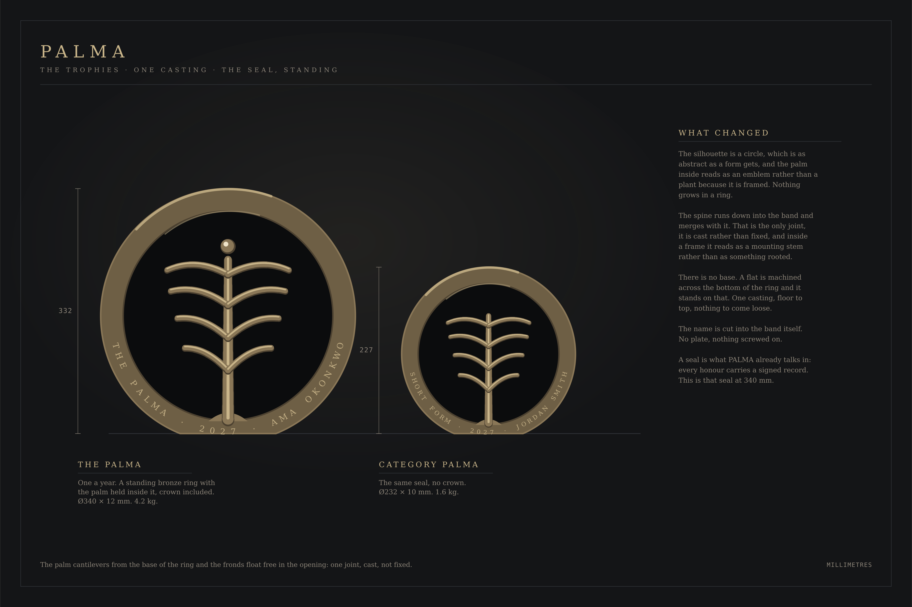
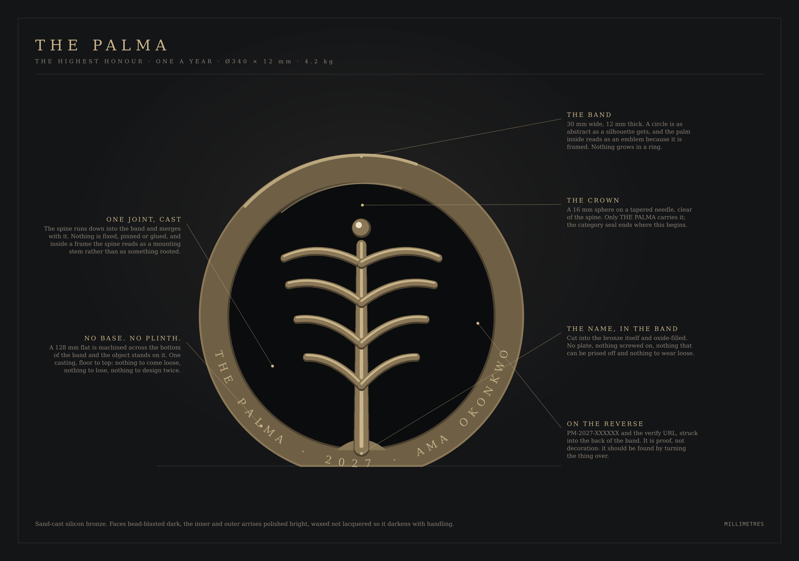

# The PALMA trophies

A brief a foundry can quote from. Every dimension, alloy and finish is stated,
and the drawings are generated from the same palm geometry the website uses, so
the object and the mark cannot drift apart.



---

## The seal, standing

**Two objects.** A bronze ring with the palm held inside it, and the hierarchy
is the crown.

|                    | What it carries                              |
| ------------------ | -------------------------------------------- |
| **THE PALMA**      | The palm inside the ring, **and the crown**. |
| **Category PALMA** | The same seal. **No crown.**                 |

A finalist is recognised by being named. There is no third object.

### Why a ring

The silhouette is a circle, which is about as abstract as a form gets, and the
palm inside reads as an **emblem** rather than as a plant because it is framed.
Nothing grows in a ring.

It is also the object PALMA already talks in. Every honour carries a signed
verification record; a seal is what that language has always described. This is
that seal at 340 mm.

### There is no base

A **128 mm flat is machined across the bottom of the band** and the object
stands on that. One casting, floor to top. No plinth, no block, no collar, no
socket, nothing to come loose, nothing to lose, and nothing to design twice.

Every earlier version put the palm on something and then had to solve what the
something was: an oak block (a wedding cake), a turned disc (better, still a
base), a tapered slab with an arched top (a headstone). Removing the base
removed the problem.

---

## THE PALMA

**Ø340 × 12 mm · 4.2 kg · one a year · never shared**



### The ring

- **Silicon bronze, sand-cast, one piece.** Not plated, not resin, not a
  bronze-coloured finish. The weight is part of the object.
- **Band 30 mm wide, 12 mm thick.** Outer Ø340.
- **Faces bead-blasted dark; the inner and outer arrises polished bright.** An
  awards photograph has one light and it is overhead: the polished arrises draw
  the circle while the faces stay quiet.
- Waxed, **not lacquered**, so it darkens with handling. The object should look
  like it has been owned.

### The palm inside

- Four opposed frond pairs, each a swept round rod of **7 mm** at the spine
  closing to a **4 mm hemisphere** at the tip. Nothing on this object is cut off
  flat.
- **The spine runs down into the band and merges with it.** That is the only
  joint in the object, it is cast rather than fixed, and inside a frame a spine
  reads as a mounting stem rather than as something rooted.
- **The crown.** A 16 mm sphere on a tapered needle, held clear of the spine.
  Only THE PALMA carries it, and the category seal ends where this begins.

### The name, in the band

Cut into the bronze itself along the bottom of the band and oxide-filled.
**No plate, nothing screwed on**, nothing that can be prised off, nothing to
work loose over thirty years.

```
THE PALMA · 2027 · AMA OKONKWO
```

### On the reverse

`PM-2027-XXXXXX · palmaawards.com/verify` struck into the back of the band. It
is proof, not decoration, and it should be found by somebody who turns the
object over looking for it.

---

## The Category PALMA

**Ø232 × 10 mm · 1.6 kg · one per category**

The same seal, the same casting, the same finishes. **No crown:** the spine
tapers and simply ends. The band carries the category, the year and the winner.

### Where a sponsor may and may not appear

A category may be presented by a partner. If it is, the partner's name appears
**on the certificate and in the programme, never on the trophy.** The object in
a winner's hands carries PALMA's mark, the category, the year and their name,
and nothing that was paid for.

This is not a style preference. It is the same line the software enforces: a
sponsor buys association with the category, not a share of the recognition.

---

## The certificate, for both

A5 landscape, 300 gsm mould-made cotton, letterpressed in ink black with the
palm **blind-embossed** — no ink, pressure only — at 42 mm.

Two signatures: the chair of the panel and one administrator, which is the same
two-person rule the software applies to conferral. The verification code is set
at the foot in monospace with the verify URL beneath it.

Blind embossing is the detail worth paying for. It cannot be photocopied, it
cannot be reproduced by a home printer, and it is felt before it is seen.

---

## What none of these are

- **Not crystal-and-chrome.** The bevelled acrylic obelisk is the corporate
  award of the last thirty years, and PALMA's whole position is that it is not
  that kind of institution.
- **Not gold plated.** Plating chips, and a chipped award is worse than a plain
  one. Solid bronze ages; plate fails.
- **Not resin, anywhere.** If cost pressure forces a change, the correct answer
  is fewer categories, not a lighter object.
- **Not engraved after the fact.** The name goes into the band before the
  ceremony, which means the winner is known to the foundry before the room. The
  workshop holds that under the same terms as the panel.

---

## The drawings

`docs/trophies/` holds both sheets as PNG and SVG, and the scripts that
generate them.

```
node docs/trophies/draw-elevation.mjs   # both, to scale
node docs/trophies/draw-detail.mjs      # THE PALMA, with callouts
```

- `geometry.mjs` reads the palm paths out of `src/components/brand/geometry.ts`
  and throws if the mark's shape changes under it.
- `shapes.mjs` holds the palette and the seal itself, shared by both sheets.

**Redraw rather than retouch.** A drawing edited by hand is how the object and
the mark quietly stop being the same palm, which has already happened once to
this institution's logo.
